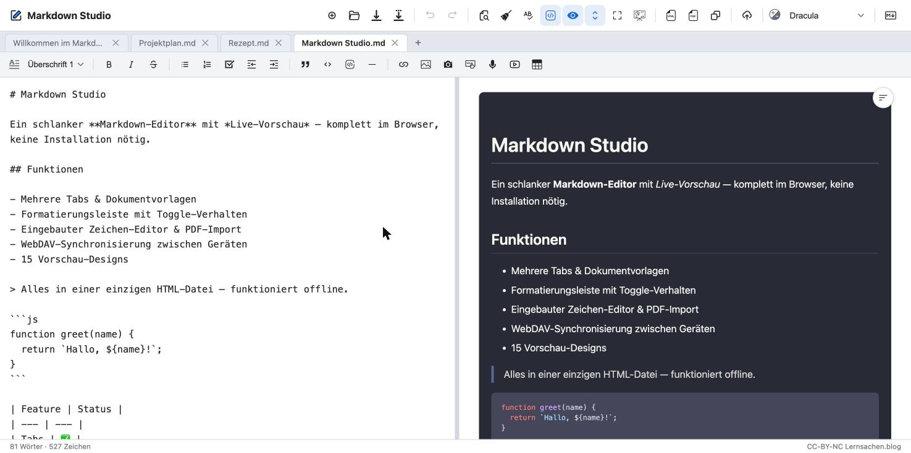

# 📝 Markdown Studio

Ein schlanker Markdown-Editor mit Live-Vorschau, der komplett im Browser läuft — keine Installation, kein Build, keine Serverseite. Die gesamte App steckt in einer einzigen HTML-Datei.

**🔗 Direkt ausprobieren:** [majort0m0.github.io/Markdown-Editor](https://majort0m0.github.io/Markdown-Editor/)

## ✨ Funktionen

- **Mehrere Tabs** — beliebig viele Dokumente gleichzeitig offen, mit Autospeicherung im Browser (LocalStorage)
- **Live-Vorschau** mit synchronisiertem Scrollen zwischen Quelltext und Vorschau
- **5 Designs** — GitHub Light/Dark, Solarized Paper, Nord Dark, Academic Serif (inkl. farbiger Code-Hervorhebung)
- **Formatierungsleiste** — Überschriften (H1–H6), Fett/Kursiv/Durchgestrichen, Listen (Aufzählung/Nummeriert/Aufgaben), Einzug/Ausrücken, Zitat, Code, Code-Block, Trennlinie, Link, Bild, Tabelle — Buttons zeigen live an, welche Formatierung am Cursor aktiv ist
- **Bilder einfügen** per Copy-Paste oder Drag & Drop — mit Dialog, ob das Bild verkleinert oder im Original eingefügt werden soll
- **Suchen & Ersetzen**, **Rückgängig/Wiederherstellen**, optionale **Rechtschreibprüfung**
- **Fokus-Modi** — Editor oder Vorschau einzeln ausblenden
- **Export** als eigenständige HTML-Datei oder direkt **Drucken/als PDF speichern**
- **Speichern** in eine lokale Datei (inkl. Speichern unter, mit direktem Dateizugriff sofern der Browser das unterstützt)
- **Tastenkürzel-Hilfe** über das ⌨️-Symbol in der Kopfzeile

## 🚀 Verwenden

**Im Browser:** Einfach den [Live-Link](https://majort0m0.github.io/Markdown-Editor/) öffnen.

**Lokal:** `Markdown-Editor.html` herunterladen und im Browser öffnen (Doppelklick genügt) — funktioniert auch offline, da alle Bibliotheken bereits in der Datei enthalten sind.

## 🛠️ Entwicklung

Die komplette App (HTML, CSS, JavaScript) liegt in `Markdown-Editor.html`. Es gibt keinen Build-Schritt, keine Abhängigkeiten zum Installieren — nach jeder Änderung einfach die Datei im Browser neu laden. Details zur internen Architektur stehen in [`CLAUDE.md`](./CLAUDE.md).

## 📄 Lizenz

CC-BY-NC — [Lernsachen.blog](https://lernsachen.blog)
